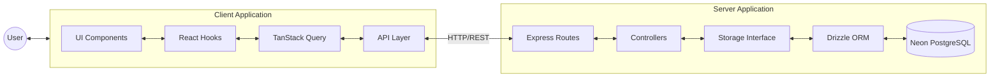
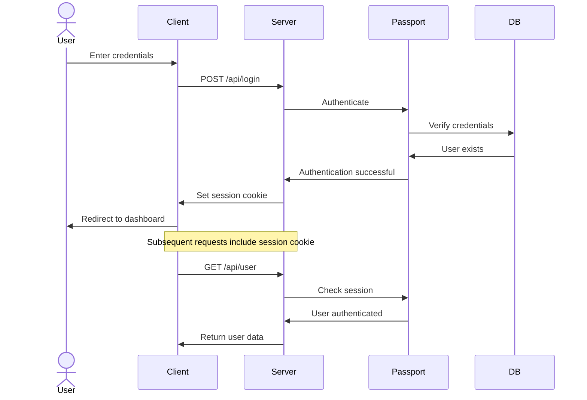
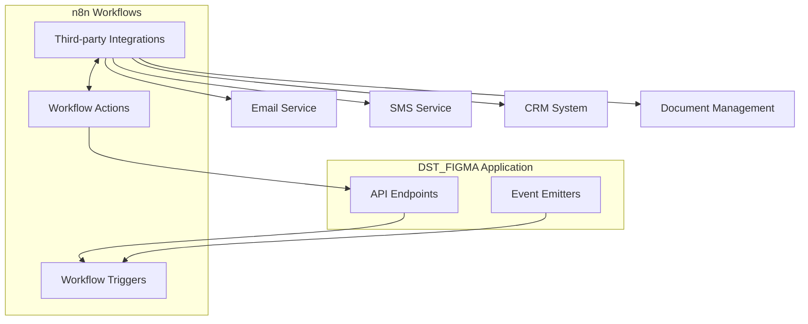

# DST_FIGMA Architecture

This document provides a high-level overview of the DST_FIGMA platform architecture, outlining the structure, data flow, authentication mechanism, and deployment strategy.

## Table of Contents

- [Monorepo Structure](#monorepo-structure)
- [Data Flow](#data-flow)
- [Authentication](#authentication)
- [Workflow Automation](#workflow-automation)
- [Deployment Strategy](#deployment-strategy)
- [Technical Decisions](#technical-decisions)

## Monorepo Structure

DST_FIGMA is structured as a two-package monorepo:

### `client/`

The client package is a modern React application with the following key technologies:

- **React 18**: Core UI library with hooks and functional components
- **Vite**: Build tool and development server
- **TailwindCSS**: Utility-first CSS framework
- **Wouter**: Lightweight routing library
- **TanStack Query**: Data fetching and state management
- **Shadcn UI**: Component library based on Radix UI
- **Zod**: Schema validation
- **react-hook-form**: Form handling

### `server/`

The server package is a Node.js application powered by:

- **Express**: Web framework
- **TypeScript**: Type-safe JavaScript
- **Drizzle ORM**: SQL toolkit with schema builder
- **Neon Postgres**: Serverless PostgreSQL
- **passport-local**: Authentication middleware
- **express-session**: Session management
- **connect-pg-simple**: PostgreSQL session store

### `shared/`

A common directory containing shared code between client and server:

- **schema.ts**: Database schema definitions using Drizzle
- **types.ts**: TypeScript interfaces and types

## Data Flow

The following diagram illustrates the data flow between the client and server:

### Client-Side Data Flow

1. User interacts with UI components
2. Components use custom hooks to access data and mutations
3. Hooks utilize TanStack Query for data fetching, caching, and updates
4. TanStack Query communicates with the API layer
5. API layer makes HTTP requests to the server

### Server-Side Data Flow

1. Express routes receive HTTP requests
2. Routes delegate to controller functions
3. Controllers use the storage interface for data operations
4. Storage interface uses Drizzle ORM to interact with the database
5. Drizzle ORM executes optimized SQL queries against Neon PostgreSQL

## Authentication

DST_FIGMA uses session-based authentication powered by Passport.js:

### Authentication Flow:
1. User submits login credentials
2. Server validates credentials using passport-local strategy
3. On successful validation, a session is created
4. Session ID is stored in a cookie in the user's browser
5. Session data is stored in PostgreSQL via connect-pg-simple
6. For subsequent requests, the session cookie is used to authenticate the user

## Workflow Automation

DST_FIGMA plans to integrate n8n for workflow automation:

### Planned Automation Workflows:
- Investor onboarding processes
- Accreditation verification
- Document processing
- Investment status updates
- Notification systems
- Reporting and analytics

## Deployment Strategy

### Current Deployment: Replit Deploy

The initial deployment strategy leverages Replit Deploy:

- **Benefits**:
  - Zero-configuration deployment
  - Integrated with development environment
  - Built-in CI/CD
  - Automatic HTTPS
  - Persistent database connection

- **Architecture**:
  - Single-instance deployment
  - Express server serving both API and static assets
  - PostgreSQL database via Neon

### Future Deployment: Vercel

A potential migration path to Vercel is planned:

- **Benefits**:
  - Edge network for global performance
  - Improved frontend performance
  - Automatic preview deployments
  - Enhanced monitoring and analytics

- **Architecture**:
  - Frontend deployed on Vercel's edge network
  - Backend deployed as Vercel serverless functions or maintained on a separate service
  - Database remains on Neon PostgreSQL

## Technical Decisions

### Why Wouter over React Router?
- Lighter bundle size
- Simpler API for our routing needs
- Hook-based routing matches our functional component approach

### Why TanStack Query?
- Built-in caching
- Automatic refetching
- Optimistic updates
- Server state synchronization
- Mutation capabilities

### Why Drizzle ORM?
- Type-safe SQL query builder
- Better performance compared to other ORMs
- Native TypeScript support
- Seamless integration with Neon PostgreSQL
- Schema migrations through code

### Why Neon PostgreSQL?
- Serverless architecture
- Auto-scaling capabilities
- Built-in connection pooling
- PostgreSQL compatibility
- Branching feature for development/testing